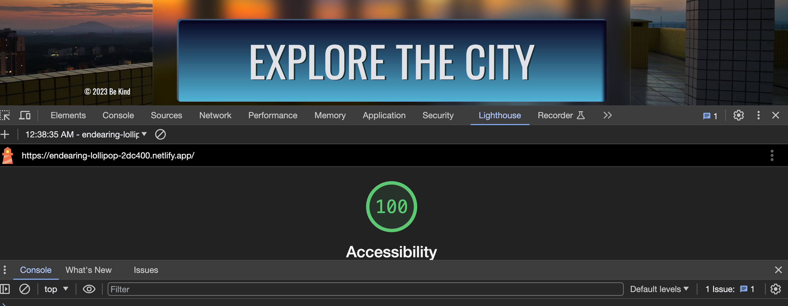

# City-Explorer-API Lab

[Repo Link](https://github.com/StepheeGee/city-explorer-api/pull/1)

[Deployed Link](https://endearing-lollipop-2dc400.netlify.app/)

[Trello Board](https://trello.com/invite/b/HvmnsiVm/ATTIaacc9ea936288de79440dc109fe256ff93E2B6CC/module-2-city-explorer)

**Author**: Stephanie G. Johnson
**Version**: 1.3.0

## Overview

The City Explorer web application is a React-based platform that leverages Axios for facilitating user-initiated requests to multiple third-party APIs. Primarily, it interacts with the Location IQ Geocoding API, Weather Bit API, and a movie API to deliver a range of functionalities:

1. **Integration of Multiple APIs**: Incorporation of Axios to interact with third-party APIs, such as Location IQ for geocoding, Weather Bit for weather forecasts, and a movie API for fetching movie information based on the selected city.

2. **Geocoding & Static Maps**: Implementation of forward geocoding functionality to convert location names into geographic coordinates. Additionally, it generates static maps using the obtained geographic coordinates through the Location IQ API.

3. **Weather Forecast**: Displaying weather forecasts based on geographic coordinates obtained from the Location IQ API. This involves integrating the Weather Bit API to retrieve and exhibit weather-related data for the chosen location.

4. **Movie Information**: Utilizing a movie API to gather and showcase details about movies related to the selected city.

## Getting Started

TBD

## Architecture

### Server Cycle Diagram

- [LocationAPI](cycle.sql)
- 
- [WrittenFlowforWeatherAPI](datachart.md)
  Courtesy of ChatGPT

### Components:

1. **App Component (app.jsx)**:
   - Main component rendering the entire application.
   - Manages states like `city`, `latitude`, `longitude`, `errorMessage`, etc.
   - Fetches data from Location IQ API based on user input.
   - Renders `Header`, `CityForm`, `Map`, `Weather`, and `Movies` components.

2. **CityForm Component (CityForm.jsx)**:
   - Renders a form for user input (city name).
   - Manages `typedInCity` state to track user input.
   - Updates `typedInCity` state based on user input changes.
   - Submits city data to the parent component (`App`) for processing.
   - Conditionally displays a heading showing information about the entered city.

3. **Map Component (Map.jsx)**:
   - Receives `latitude` and `longitude` as props.
   - Renders a static map image using Location IQ API based on provided latitude and longitude.

4. **Weather Component (Weather.jsx)**:
   - Fetches weather data using the Weather Bit API based on geographic coordinates.
   - Displays weather forecast information for the selected city.

5. **Movies Component (Movies.jsx)**:
   - Utilizes a movie API to fetch and showcase movie details linked to the chosen city.

### Functionality:

- **TLDR: API Integration**:
  - Uses Axios to perform HTTP requests to Location IQ, Weather Bit, and movie APIs.
  - Fetches geocoding data, weather forecasts, and movie information based on user input.

The City Explorer backend is an essential part of the application responsible for managing API requests, fetching data from external sources, and handling server-side operations. Here's an overview of its functionalities and the technologies it employs:

### Overview of Backend Functionalities:

1. **API Proxying**: The backend serves as a proxy to handle API requests from the frontend. It acts as an intermediary, receiving requests from the frontend application, and then forwards these requests to the respective third-party APIs, like the Location IQ, Weather Bit, or movie API.

2. **Data Aggregation**: Backend components aggregate and process data obtained from multiple APIs. For instance, it might fetch geographical coordinates from the Location IQ API, weather forecasts from Weather Bit, and movie information from a movie API, then aggregate this information for the frontend to consume.

3. **Data Processing & Formatting**: The backend might perform operations on fetched data, such as data formatting, filtering, or combining responses from different APIs to provide a unified and structured dataset to the frontend.

4. **Error Handling & Logging**: It handles error scenarios, managing cases where API requests fail or encounter issues. Additionally, it might log errors and system events for debugging and monitoring purposes.

### Technologies Used:

1. **Node.js**: A JavaScript runtime environment used to execute server-side code.
   
2. **Express.js**: A popular web application framework for Node.js used for building RESTful APIs and web applications. Express simplifies routing, middleware creation, and handling HTTP requests.

3. **Axios**: A promise-based HTTP client used to make HTTP requests from the backend to external APIs. Axios simplifies handling asynchronous operations and API requests.

4. **API Keys and Environment Variables**: Usage of environment variables to securely store and access API keys and sensitive information required for communication with third-party APIs.

5. **Logging Libraries**: Implementation of logging libraries like Winston or Morgan to record system events, errors, and other relevant information.

6. **Error Handling Middleware**: Express middleware or custom error handling mechanisms to manage errors, exceptions, and unexpected behavior within the application.

7. **Data Parsing and Manipulation Libraries**: Libraries for parsing and manipulating data obtained from APIs, such as JSON parsing libraries or data formatting tools.

8. **Proxy Server Setup**: Potential configuration or setup for a proxy server to handle frontend-backend communications and API proxying.

This backend setup ensures that the frontend application interacts seamlessly with various APIs while providing a robust and reliable data retrieval mechanism for the City Explorer application.

### Environmental Setup:

- `.env` file stores sensitive data like API_KEY, accessed via `import.meta.env.VITE_API_KEY`.
- API_KEY used across components to authenticate requests to Location IQ, Weather Bit, and movie APIs.

### Overall Flow:

- User inputs a city name in `CityForm`.
- `App` triggers requests to Location IQ API using Axios, fetching location data for the entered city.
- Retrieved latitude and longitude passed to `Map`, `Weather`, and `Movies` components for data retrieval and display.

## Change Log

**12-04-2023 7:27pm - Version: 1.0.0**

- Initial project structure setup.
- Integrated Axios for HTTP requests.
- Implemented location data fetching from Location IQ API.
- Displayed static map using obtained latitude and longitude.

**12-06-2023 3pm - Version: 1.1.0**

- Endpoints established and communicating.
- Data retrieval from JSON format.
- Deployed project using Render and Netlify.

**12-06-2023 11:30pm - Version: 1.2.0**

- Deprecated JSON path.
- Integrated Weather Bit API and updated logic.

**12-07-2023 12:42pm - Version: 1.3.0**

- Code refactoring.
- Added styling using CSS and Bootstrap.

## Credit and Collaborations

Thank you, Brandon!! (TA)

## Time Estimates

Lab 7. 12.5.23 - 3 Features - 10 plus hours
Lab 8. 12.6.23 - 3 Features - 11 hours 
Lab 9. 12.7.23 - Refactoring - 9 hours

## Lighthouse

Tuesday -

Wednesday -

