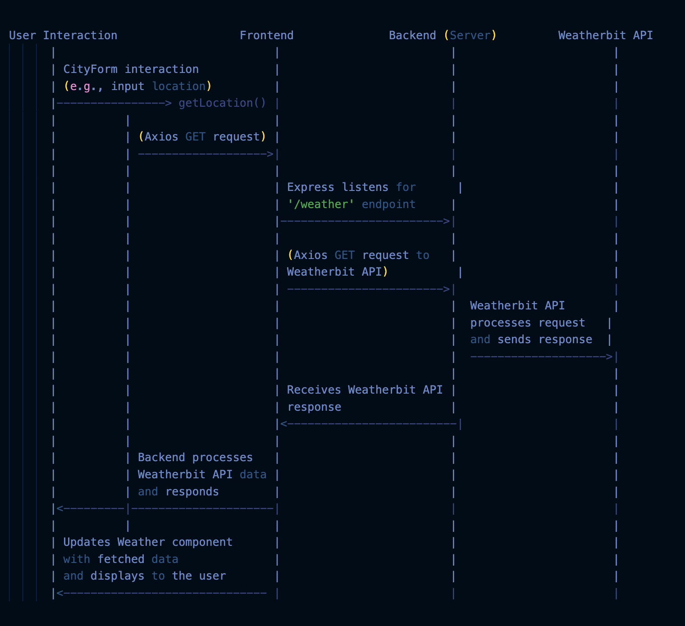
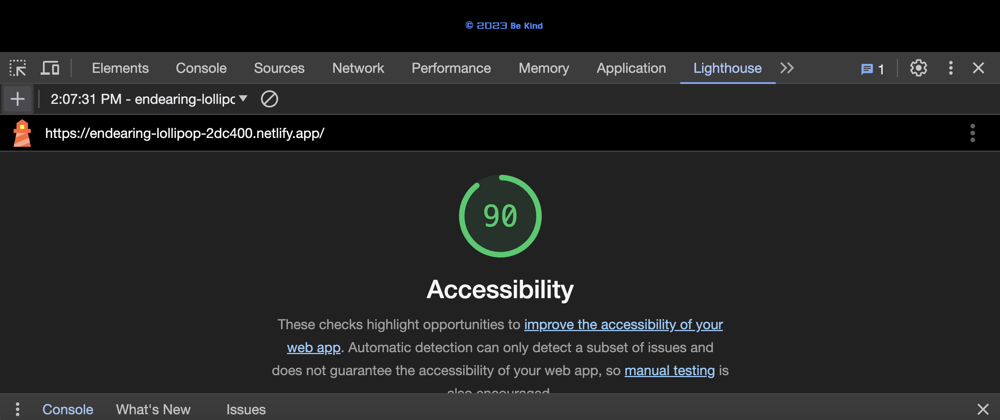

# City-Explorer-API Lab

[Repo Link](https://github.com/StepheeGee/city-explorer-api/pull/1)

[Deployed Link](https://endearing-lollipop-2dc400.netlify.app/)

[Trello Board](https://trello.com/invite/b/HvmnsiVm/ATTIaacc9ea936288de79440dc109fe256ff93E2B6CC/module-2-city-explorer)

**Author**: Stephanie G. Johnson
**Version**: 1.1.1

## Overview

The problem domain for this assignment involves building a React application that integrates the Axios library to facilitate user-initiated requests for data from a specific third-party API, namely the Location IQ Geocoding API. We use two key functionalities:

1. **Integration of Axios**: This involves incorporating the Axios library within a React application to handle HTTP requests effectively. It would require understanding how Axios works, making use of its methods to send requests, handle responses, and manage data retrieval from the Location IQ API.

2. **Utilizing Location IQ Geocoding API**:
   - **Search / Forward Geocoding**: Implementing functionality that allows users to perform forward geocoding, i.e., converting addresses or location names into geographic coordinates (latitude and longitude) using the Location IQ API.
   - **Static Maps**: Possibly creating static maps based on the obtained geographic coordinates or other location-related data retrieved from the API.

## Getting Started

TBD

## Server Cycle Diagrams

[LocationAPI](cycle.sql)

[WrittenFlowforWeatherAPI](datachart.md)

## Change Log

12-04-2023 7:27pm - 
Version: 1.0.0
Set up the project structure.
Integrated Axios for making HTTP requests.
Implemented functionality to fetch location data from the Location IQ API based on user input.
Displayed a static map using fetched latitude and longitude.

Version: 1.0.1
Fixed handling of errors when fetching location data.
Enhanced UI feedback for error messages or loading indicators during API requests.
Added more specific error handling and messages for failed API requests.

12-06-2023 5:30pm 
Version: 1.1.0
Endpoints Communicate
Data is fetched from JSON
Deployed with Render and Netlify

12-06-2023 11:30pm
Version: 1.2.0
Deprecated the path to the JSON
Added the Weather Bit API and changed the logic 
Tested front and backend to ensure functionality

## Credit and Collaborations

Thank you soooooo much Brandon (TA)

## Time Estimates

I didn't do a careful job of logging this yesterday and today. I can say that I thought I would complete the lab before the deadline, and I didn't. But after spending a lot of time with TA Brandon, and being the code review example in class, my lab is complete. It took me 9 hours on 12.5.23 and 4 hours today, 12.6.23.

Lab 6. 12.4.23 - Front End only. Separate Repo
Lab 7. 12.5.23 - 3 Features - 10 plus hours
Lab 8. 12.6.23 - 3 Features - 5 hours and still working

## Lighthouse

Tuesday -

Wednesday -
